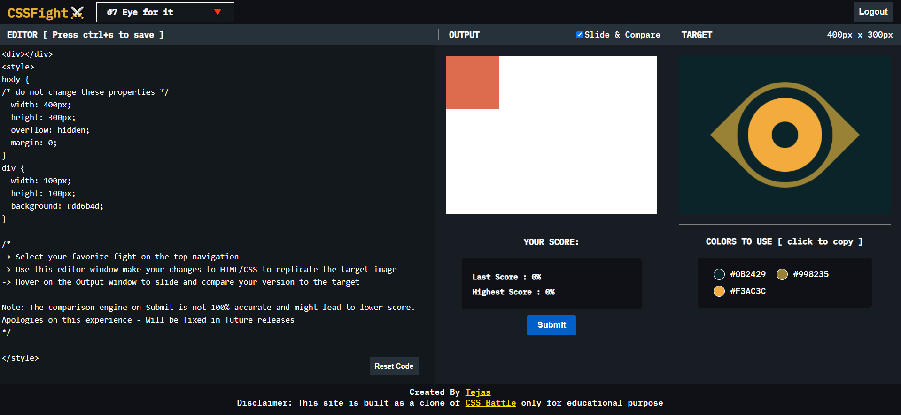

# CSS Fight

A fun filled, skill packed unique web application to test your CSS skills. Given variety of challenges, use your creativity to replicate the targets.

### Features

- Landing page to select your fav targets by the levels
- Play arena for your fight
- Live output to watch your changes
- Compare your code with target
- Submit and get to know your score

### Tech Stack

- React
- Express
- Mongo
- Resemble JS for Image Comparison

### Reflection

I was always a bit hesitant on my ability about CSS, andly luckily on a good day I came accross CSS Battle - A web app where you replicate the target presented. It was fun, interesting and at the same time taught CSS the best way possible - just practicing. I consistently played it everyday and in no time I had immense confidence in CSS, good enough to believe I can achieve anything in CSS.

As an inspiration and out of curiosity on how this worked, I build CSS fight - a clone of CSS battle.
Building this app was quite a different experience. I have spent around 30-40 Hours on this. Helped me explore dynamic position tracking and aspects of image comparison.

### Upcoming Features

- Leader Boards
- Improved Image comparison

### Installation & Usage

Clone down this repository. You will need `node` and `npm` installed globally on your machine.

`npm install`

To Start Server:

`npm start`

To Visit App:

`localhost:3000`
